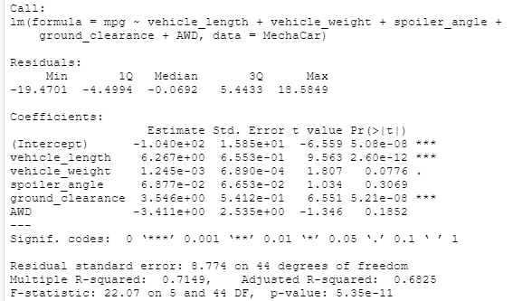
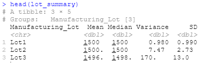
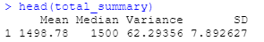

# MechaCar_Statistical_Analysis
Statisitical analysis of automobile performance with R

# Overview
AutosRUs' newest prototype, the MechaCar, is suffering from production troubles that are blocking the manufacturing team’s progress. The data analytics team has been tasked to review the production data for insights that may help the manufacturing team.

# Results
## Linear Regression to Predict MPG

•	*Which variables/coefficients provided a non-random amount of variance to the mpg values in the dataset?*

Vehicle weight, spoiler_angle & AWD provided a non-random amount of variance. The two variables that had the grestest amount of random variance were ground_clearance (6.551) and vehicle_length (9.563).

•	*Is the slope of the linear model considered to be zero? Why or why not?*

Our slope is not zero, but is less than 0.05.

•	*Does this linear model predict mpg of MechaCar prototypes effectively? Why or why not?*

The linear model is somewhat effective at predicting mpg. The r-squared value of 0.7149, shows that the model is 71% accurate, which could be better

.
## Summary Statistics on Suspension Coils

**Suspension Coil Total Summary**

**Suspension Coil Lot Summary**

•	The design specifications for the MechaCar suspension coils dictate that the variance of the suspension coils must not exceed 100 pounds per square inch. Does the current manufacturing data meet this design specification for all manufacturing lots in total and each lot individually? Why or why not?

While the overall variance, as shown in the Total Summary data above, is under 100 psi and meets specifications, there is a problem with one of the individual lots. As shown in the Lot Summary stats, the variance for Lot 3 is well over the acceptable threshold, at 170.28.

## T-Tests on Suspension Coils
Suspension Coils Cumulative T-test Suspension Coils Cumulative T-test

A review of the results of the T-test for the suspension coils across all manufacturing lots shows that they are not statistically different from the population mean, and the p-value is not low enough (0.0603) for us to reject the null hypothesis. Suspension Coil Lot 1 T-test
A review of the results of the T-test for the suspension coils for Lot 1 shows that they are not statistically different from the population mean, and the p-value is not low enough (1) for us to reject the null hypothesis. Suspension Coil Lot 2 T-test
A review of the results of the T-test for the suspension coils for Lot 2 shows that they are not statistically different from the population mean, and the p-value is not low enough (0.6072) for us to reject the null hypothesis. Suspension Coil Lot 3 T-test
A review of the results of the T-test for the suspension coils for Lot 3 shows that they are slightly statistically different from the population mean, and the p-value is just low enough (0.0417) for us to reject the null hypothesis. This lot may be need to be discarded, or at least more closely evaluated.
Study Design: MechaCar vs Competition
There are many factors that consumers take into consideration when evaluating a car to purchase. However, in a world where ridesharing is becoming more ubiquitous and it's easy and cheap to get around in other people's vehicles, customers looking to purchase a car are looking for more than just a conveyance. They will be looking to buy a car that is an economical means to regularly transport themselves and their items on a reliable, regular basis.

Metric to test
To narrow down our test, we should evaluate MechaCar's carrying capacity, in cubic inches, in comparison to various competitors' vehicles.

Null and Alternate Hypothesis
H0: MechaCar prototypes' average carrying capacity is similar to competitor's vehicles in the same vehicle class Ha: MechaCar prototypes' average carrying capacity is statistically above or below that of competitor vehicles.

Statistical Test Used
The best statistical test for this would be two-sample t-tests.

What data is needed
We would need to gather cubic space data from the carrying compartments of all MechaCar prototypes, as well as from all major competitor vehicles.
